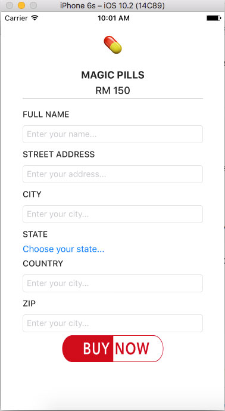

# Swift Learning Projects
#### build by [superoo7](http://superoo7.com)
### 1. quiz \[Done\]
	This is an app that make user to answer quizzes
	- Button and show answer at user view
	- Input: When user pressed button
	- Output: show answer
	- Basic Model, View and Controller (MVC)

### 2. PageScroll \[Done\]
    This app is build with xcode8 and swift to try out scroll view of iOS app.
    - scroll view

### 3. PillTrader \[Done\]
#### Preview

	This app is an app that sell pill
	- uses isHidden and state view
	- added a state view
	- added some iOS images
	- minimal interface when BuyNowBtn pressed.

### 4. Food Tracker
    
### 5.
